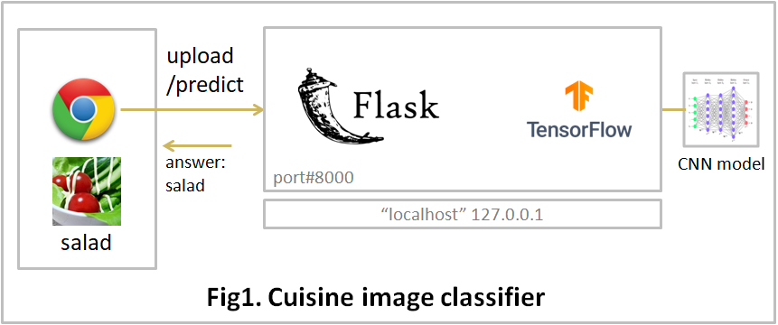

# cuisine-image-classifier

# 1. What you can do

* To predict which class an image belong to by using the pre-trained model. 
  The classification classes consist of "salad", "sushi" and "tofu".

* (CAUTION) This repository is for beginners' learning.  The precision of the model is not so good.

 

 

# 2. How to use

* Install the prerequisite python libraries

* Get a model file from the GitHub repository of 'cuisineimageclassifier-jupyter'

  STEP1: > git clone git@github.com:paw27182/cuisineimageclassifier-jupyter.git

  STEP2: Copy the model file of 'best_model_2.20.0.keras' to the following directory.

         ~/cuisineimageclassifier-flask/appmain/model

* Environment setting
  * Edit settings.py
    * PYTHON_EXE_FILE 

 

* Program start
  * cd cuisineimageclassifier-flask
  * python.exe app.py

 

* Open browser
  * http://localhost:8000/
  * Submit an image file: 
   ./cuisineimageclassifier-flask/tests/salad.jpg

 

# 3. System
* OS: Windows 10/11, Ubuntu 20.04.6 LTS
* Web Framework: Flask
* Python 3.13.7
* Python Libraries: See the requirements.txt file
* Bootstrap 5.2.3
* jQuery 3.7.1

 

# 4. Directories and Files Overview

| Directory/File |D/F| description |
| :------------- | :-| :---------- |
| appmain | Dir | predict program directory |
| appmain/model | Dir | Machine learning model |
| appmain/static | Dir | html, javascript files |
| appmain/templates | Dir | html files |
| appmain/appmain_bp.py | File | dispatcher |
| appmain/command.py | File | Machine learning predict program |
| static | Dir | css, javascript files |
| templates | Dir | layout.html |
| tests | Dir | test image files |
| topview | Dir ||
| app.py  | File | start program |
| README.md | File ||
| requirements.txt | File | prerequisite libraries |
| setting.py | File ||
